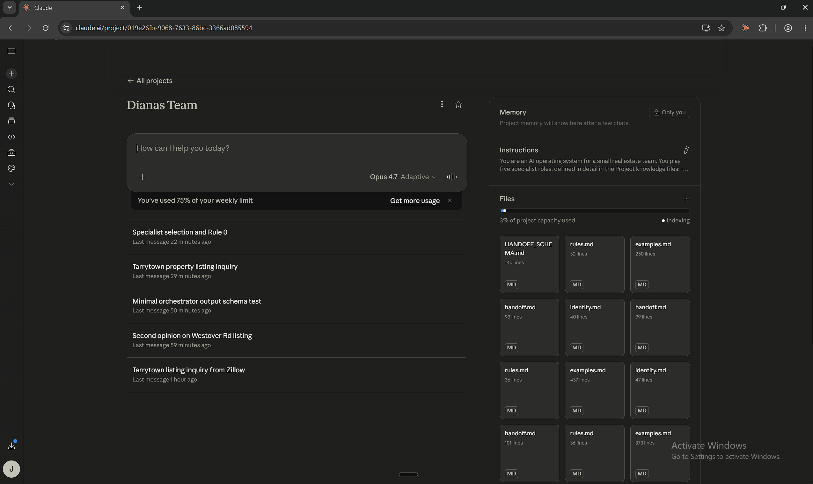
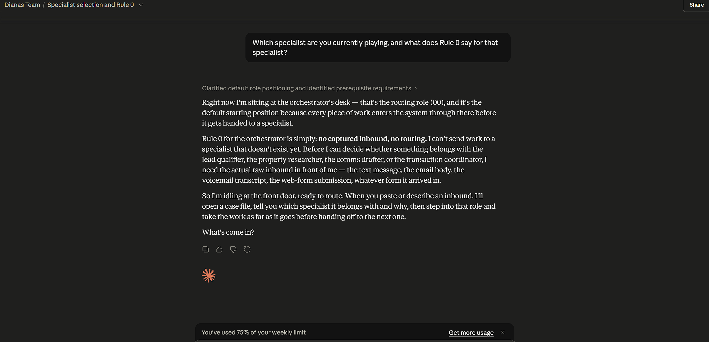

# Diana's Team — Five-Specialist Workflow System

**Diana — a hypothetical realtor running a small Austin-based team — wants a system her team can learn in a week, not a piece of software they have to install.** This is that system.

> **Prefer to watch?** [The whole walkthrough as a YouTube playlist](https://www.youtube.com/playlist?list=PLmGyUnGlt796ixe5A5RN8UquBI9mYSLOY) — 8 clips covering setup + the quickstart end-to-end.

<!-- mark: content-type=density media=text-decomposition id=m1 -->
Five folders of plain-English instructions, one per role on the team. The "five roles" are positions the AI plays — they are not five people you need to hire.

The AI drafts; you — the licensed realtor — review and send everything that goes to a client.

You set it up in five minutes by uploading the folders into a free Claude.ai account. <!-- mark: content-type=opacity media=video-clip id=m2 capture-action="Video stripped from intro 2026-05-14 — was reader-first-action-disorientation (Andy hadn't been told to download yet); m7 screenshot + m8 video in Setup step 2 cover the same beat. m2 marker retained for audit trail; the m2 clip is referenced from the Setup section now." -->

Then you walk through a real inbound lead and see how the system thinks. About fifteen minutes start-to-finish.

---

## The deal binder picture

<!-- mark: content-type=density media=text-decomposition id=m3 -->
If it helps, picture an old-school manila binder. One per deal. The case number is on the spine.

Inside is every document about that case: the inbound, the qualifier's notes, the research brief, drafts, the executed contract, the deadline tracker.

A few stamps on the binder's cover indicate where the inbound came from:

- **[UNVERIFIED]** — anonymous (Zillow relay, web form, voicemail with no callback). You do not know who the person actually is yet.
- **[CLIENT]** — identity confirmed by phone or by linking to an existing case.
- **[TEAM]** — a team member logged this themselves (an inspection report, a status update).

The stamps matter because the rules change downstream. A binder stamped [UNVERIFIED] cannot get a "Hi Sarah" email drafted on it — neutral salutation only — until someone confirms who Sarah actually is. <!-- mark: content-type=state-transition media=diagram caption="Excalidraw diagram: [UNVERIFIED] binder cover → arrow labelled 'identity confirmed by call' → [CLIENT] binder cover. Show 'Hi Sarah' email blocked under [UNVERIFIED], allowed under [CLIENT]." id=m4 capture-action="Produce Excalidraw diagram per caption" -->

![Diagram showing an [UNVERIFIED] binder cover transitioning via 'identity confirmed by call' to a [CLIENT] binder cover. A 'Hi Sarah' email is blocked under [UNVERIFIED] and allowed under [CLIENT].](Screenshots/m4.png)

<!-- mark: id=m5 stripped-from-deal-binder-section — relocated to Quickstart step 1 where the live case-file-stamp moment actually happens for the user; Deal Binder Picture stays concept-only with m4 diagram -->
<!-- mark: content-type=density media=text-decomposition id=m6 -->
This binder is conceptual. In practice, it is a structured note Claude maintains in the conversation.

You do not see schema vocabulary while using the system. You see Claude saying *"I have opened a new case file (CASE-2026-0042) and stamped it [UNVERIFIED] — handing to the qualifier."* That is the same thing.

---

## What you need before you start

- A Claude.ai account. The free tier works. Paid (Claude Pro) gives longer conversations and faster responses; either is fine.
- The **Projects** feature inside Claude. It is in the sidebar at claude.ai once you sign in. Free accounts get it.
- About fifteen minutes. Five to set up, ten to try it on a lead.
- One real or made-up inbound lead to walk through. There is one in the quickstart below if you do not have one ready.

No Zapier, no Make.com, no CRM integration. You can layer those in later if you want.

---

## Before you start: get the files

You need the `agency-system/` folder on your machine before you can upload anything.

1. **[Click here to download the `.zip` directly.](https://github.com/JamesMack05/agency-system/archive/refs/heads/main.zip)** Save it anywhere on your computer.
2. Right-click the downloaded file and choose **Extract All** (Windows) or double-click it (Mac).

The folder you're looking for after extraction is `agency-system-main/` (GitHub adds the `-main` suffix on the download). You only need to find it once.

<!-- mark: bonus pre-m2-download — closes E8 prerequisite-gap; not in v1 manifest -->
[](https://youtu.be/q8IoSbKFzn0)

After extraction, open the folder. You should see five sub-folders (one per specialist: `00_orchestrator/`, `01_lead_qualifier/`, `02_property_research/`, `03_client_communication/`, `04_transaction_coordinator/`) plus `HANDOFF_SCHEMA.md` sitting in the main folder, not inside any sub-folder.

<!-- mark: bonus pre-m2-folder — closes E8 prerequisite-gap; not in v1 manifest -->


---

## Setup in five minutes

[](https://youtu.be/XxGN6bIO0nM)

*A quick preview of all three Setup steps below.*

1. **Go to claude.ai and sign in.** In the left sidebar, click **Projects**, then **Create Project**. Name it `Diana's Team` (or your team's name). <!-- mark: content-type=verification-gap media=screenshot caption="Two-frame screenshot: (a) Claude.ai sidebar with 'Projects' highlighted; (b) the 'Create Project' modal with the name field filled. Annotation: 'You should see the new project appear in the sidebar list immediately after Create.'" id=m7 capture-action="Capture two-frame screenshot per caption (claude.ai web UI)" -->

   .png>)

2. **Upload the files.** Open the project. Find the **Project knowledge** section. Upload these files from the repo:

   - `HANDOFF_SCHEMA.md` (root)
   - Everything inside `00_orchestrator/` (4 files)
   - Everything inside `01_lead_qualifier/` (4 files)
   - Everything inside `02_property_research/` (4 files)
   - Everything inside `03_client_communication/` (4 files)
   - Everything inside `04_transaction_coordinator/` (4 files)

   That is 21 files. Drag-and-drop works — you can drag whole folders or open each folder and drag the 4 files inside. <!-- mark: content-type=opacity media=video-clip caption="30-second OBS clip showing the drag-drop into Project knowledge. Show both flows: (a) dragging the whole 00_orchestrator/ folder; (b) opening the folder and dragging individual files. Show the file count climbing in the Project knowledge sidebar as files land." id=m8 capture-action="Record OBS clip per caption (30 sec, claude.ai screen)" -->

   [](https://youtu.be/xwu2kI3qNOo)

   **Do not upload `README.md`, `ARCHITECTURE.md`, or the `decisions/` folder.** Those are for you to read, not for Claude. Uploading them clutters the project's context.

   When the upload completes, you should see **21 files** listed in Project knowledge. <!-- mark: content-type=verification-gap media=screenshot caption="Screenshot of Project knowledge showing all 21 files listed. Annotation: 'Your file count may differ if filenames collide and Claude merges them; check at least that every folder's four-file pattern is intact.'" id=m9 capture-action="Capture screenshot per caption (claude.ai Project knowledge view)" -->

   .png>)

3. **Set the system prompt.** Open the project's **Custom instructions** (sometimes called "Project instructions"). Paste this block: <!-- mark: content-type=opacity media=video-clip caption="Promoted from Phase 4 screenshot → video-clip per R5.1 (matrix rank-1 for opacity + low-tool+low-domain). Suggested capture: 15-second OBS clip — scroll to find the Custom instructions field (named differently than expected); click into it; paste the block; close the modal. Shows the field's location AND the paste action in one." id=m10 capture-action="Record OBS clip per caption (15 sec, claude.ai Project settings)" -->

   [](https://youtu.be/8ugBxp8heL4)

   ```
   You are an AI operating system for a small real-estate team. You play five specialist roles, defined in the Project knowledge files:

   - 00_orchestrator — routes every inbound to the right specialist
   - 01_lead_qualifier — qualifies new prospects (timeline, pre-approval, budget)
   - 02_property_research — pulls comps and neighbourhood briefs
   - 03_client_communication — drafts emails and texts in the realtor's voice. You NEVER send to a client. The realtor reviews and sends.
   - 04_transaction_coordinator — tracks deadlines once a contract is executed

   Every time work moves between specialists, it travels in a structured "envelope" — see HANDOFF_SCHEMA.md.

   When I hand you work, start by telling me which specialist is the right starting point and why. Then play that role end-to-end. When that specialist is done, hand off to the next via an envelope.

   If a specialist needs information they don't have, hand the work BACK with a typed reason (back_data_missing, back_scope_mismatch, back_quality_failure, back_compliance_block). Don't fake missing data — tell me what's missing.

   Speak in plain English to me. Say "opening a case file" or "handing this back because we're missing the timeline" — not schema names like "envelope" — unless I ask for the technical view. When you refer to the human on the deal, always say "realtor" or "licensed agent", never just "agent".

   I am the licensed realtor. I review every client-facing message before it sends.
   ```

4. **Open a new chat in the project.** You should see an empty chat window with the project's name in the header. That is it — you are set up. <!-- mark: content-type=verification-gap media=screenshot caption="Screenshot of the empty new-chat view with the project name visible in the header bar. Confirms the chat is scoped to the project, not a vanilla Claude conversation." id=m11 capture-action="Capture screenshot per caption (claude.ai new-chat view inside the project)" -->

   

If Claude tells you it cannot find a file referenced in the prompts, double-check the upload completed. The system needs all 21 files to function.

---

## Try it: your first lead in fifteen minutes

Paste this into your project chat:

> Inbound at 14:32 — Zillow web form on the Tarrytown listing:
>
> *"Hi, saw your Tarrytown listing on Zillow, can someone reach out? — Sarah"*
>
> Walk this through the system. Start at 00_orchestrator.

Claude will respond in steps. Here is what you should see, and what you do at each one. <!-- mark: content-type=runtime-trace media=video-clip caption="3-minute OBS clip recording the actual quickstart from paste-to-draft-email. Capture the realtor's screen as Claude responds; pause-points where the realtor provides input. Load-bearing single artefact for the multi-modal-learner gap." id=m12 capture-action="Record OBS clip per caption (3 min, full quickstart end-to-end)" -->

[](https://youtu.be/vG62MBVCS_Y)

1. **The orchestrator routes.** Claude opens a fresh case file (something like CASE-2026-0042), stamps it [UNVERIFIED] because Zillow web forms do not tell you who is actually typing, and hands off to `01_lead_qualifier`. You should see Claude say something like *"opening a case file, stamping [UNVERIFIED], handing to the qualifier."*

   [![Claude opening a case file and stamping it \[UNVERIFIED\] in a live chat](https://img.youtube.com/vi/RJxpc-bKSaA/hqdefault.jpg)](https://youtu.be/RJxpc-bKSaA)

2. **The qualifier asks for the three-question filter.** It cannot fill the answers itself. It tells you what to ask Sarah on the phone: timeline, pre-approval status (whether her mortgage lender has confirmed she can borrow up to a specific amount), budget. You make the call — or, if you're just walking through the demo with no real Sarah, the sample reply at step 3 below stands in for what she would have said.

3. **You report back.** Once Sarah is on the phone you type the answers she gives you into the chat. If you're walking through the demo, paste this sample reply instead — it's the one used in the video above:

   > Sarah picked up. Pre-approved with Frost Bank for $850k. Wants to move in sixty days. Downsizing from Westlake.

4. **The qualifier promotes the case to [CLIENT].** Identity is confirmed by the call. <!-- mark: content-type=state-transition media=diagram caption="Excalidraw diagram: the case-file 'cover' visibly changes stamp from [UNVERIFIED] to [CLIENT] at the moment the realtor reports back. Caption: 'This change unlocks personalised drafting later — \"Hi Sarah\" is now allowed where it was blocked before.'" id=m13 capture-action="Produce Excalidraw diagram per caption (or reuse m4's diagram with the live-walkthrough framing)" -->

   ![The case-file cover visibly changes stamp from [UNVERIFIED] to [CLIENT] at the moment the realtor reports back. This change unlocks personalised drafting later — 'Hi Sarah' is now allowed where it was blocked before.](Screenshots/m13.png)

   The qualifier hands off to `02_property_research` with the qualified payload.

5. **The researcher asks for MLS data.** Claude does not have access to UnlockMLS (Austin's MLS — the multiple-listing service realtors use to look up recent sales and active listings) or paid data feeds. It tells you what it needs — typically 3-5 recent comparable sales (**comps**) for Tarrytown plus neighbourhood facts (schools, commute, walkability). **You pull this from your MLS and paste it into the chat.**

   If you're walking through the demo and don't have MLS access, paste this sample data instead — it's the same data used in the video above:

   ```
   MLS comps for Tarrytown (78703) — past 90 days:

   1. 2410 Westover Rd — sold $1.45M, 3BR/2BA, 2,100 sqft, 0.21 ac lot, 65 DOM, closed May 2026
   2. 1908 Westlake Dr — sold $2.30M, 4BR/3BA, 2,800 sqft, 0.32 ac, 22 DOM, closed Apr 2026
   3. 3504 Bonnell Dr — sold $1.85M, 4BR/2.5BA, 2,400 sqft, 0.18 ac, 41 DOM, closed Mar 2026
   4. 1601 Pemberton Pl — sold $2.10M, 4BR/3BA, 2,750 sqft, 0.25 ac, 38 DOM, closed Feb 2026
   5. 2208 Tower Dr — actively listed $1.95M, 4BR/3BA, 2,600 sqft, 0.20 ac, 14 DOM

   Neighbourhood facts:
   - Schools: Casis Elementary (9/10), O. Henry Middle (8/10), Austin High (8/10)
   - Commute: 8-12 min to downtown Austin via MoPac
   - Walk Score: 45/100, Bike Score: 52/100
   - Tarrytown (78703) median home value: $1.7M
   - 90-day median DOM: 35
   ```

   (DOM = days on market.) The researcher structures what you give it into a brief with a price band (a range, not a specific number — the price decision is yours).

6. **The communicator drafts the first-touch email.** In your voice — or in a generic professional tone if you haven't configured a voice file yet (the voice file is set up once per realtor, separately from this README; until it's configured, drafts read as polite-but-neutral). You should see a complete draft email with subject line, salutation, body, signature.

7. **You review and send.** Open Gmail (or Outlook, or whatever you use). Paste the draft. Edit if needed. Send.

The AI never sends. You always do.

---

## When the system hands work back

Suppose at step 2 above, you could not reach Sarah — voicemail, no callback. The qualifier cannot qualify without the answers. Instead of guessing, it hands the work back: *"missing: timeline, pre-approval, budget — cannot qualify until we reach her."* <!-- mark: content-type=state-transition media=diagram caption="Excalidraw diagram: the forward arrow (01 → 02) crossed out and replaced with a back arrow (01 → 00) labelled 'back_data_missing'. Caption: 'When required information is missing, the binder walks back instead of forward — and the next specialist never sees an incomplete case file.'" id=m14 capture-action="Produce Excalidraw diagram per caption" -->


That back-handoff is the most important thing about this system. It means the next specialist (the drafter) never sees an incomplete case file. The realtor sees the hand-back, decides what to do (try again? leave a voicemail? wait?), and re-routes when ready.

Four typed reasons for sending work back, depending on what is wrong. Each references **Rule 0** — every specialist has one absolute precondition that must be true before they will do anything (defined at the top of their `rules.md` file):

- `back_data_missing` — Rule 0 is satisfied but a required field is not filled.
- `back_scope_mismatch` — the work landed at the wrong specialist. Example: a CMA (Comparative Market Analysis — a research request for sale-price estimates) routed to the qualifier as if it were a new-lead-qualification.
- `back_quality_failure` — the upstream specialist's output isn't confident enough to act on (e.g. the qualifier flagged the lead as "maybe pre-approved" rather than "yes" or "no").
- `back_compliance_block` — a regulatory boundary was crossed. For a Texas team the three common ones are **UPL** (Unauthorised Practice of Law — giving legal advice without a license), **TRELA §1101.563** (the Texas Real Estate License Act provision against acting outside your licensed scope), and **REALTOR® Code Article 16** (the rule against contacting someone already represented by another REALTOR®). For other states, swap in the equivalent rules — your broker will know which.

You see the typed reason in plain English. Claude will say *"handing back to the qualifier — we cannot proceed without a pre-approval letter; that is a compliance block under Article 16 if Sarah already has another agent representing her."* <!-- mark: content-type=opacity media=video-clip caption="Promoted from Phase 4 annotation → video-clip per R5.1 (matrix rank-1 for opacity + low-tool+low-domain). Suggested capture: 20-second OBS clip showing a live back-handoff response in a Claude chat — paste an inbound that triggers Article 16 back_compliance_block; capture Claude's plain-English explanation. The realtor SEES the back-reason mechanism in action, not just defined in text." id=m15 capture-action="Record OBS clip per caption (20 sec, claude.ai chat showing a triggered back-handoff)" -->

[](https://youtu.be/2S6Dt6_M4xw)

---

## What the AI does vs what you do

| Situation | The AI does | The realtor does |
|---|---|---|
| Inbound arrives | Routes, opens a case file, stamps the source | Hands the inbound to the AI; reviews routing if it looks wrong |
| New prospect on the phone | Tells you the three-question filter; logs what you tell it | Makes the call; asks the questions |
| Comps for a listing | Pulls public data, structures a brief, gives a price *band* | Sets the price; uses the band as input |
| First-touch email | Drafts in your voice based on the case file | Reads, edits, sends |
| Executed contract | Sets up the deadline tracker, flags items 24 hours before they are due (T-24h) | Acts on the flags; signs documents; talks to the client |
| Anything client-facing | Drafts and proposes | **Always reviews and sends** |
| Compliance question (UPL, TRELA) | Refuses and tells you why | Decides what to do — usually loops in the broker |

The AI never makes price opinions. It never sends to a client. It never gives legal or financial advice. If you ask it to, it will refuse and tell you it is refusing — that is by design.

---

## The five specialists at a glance

| # | Folder | Role | Rule 0 |
|---|---|---|---|
| 00 | `00_orchestrator/` | Routes every inbound; resolves the case ID; sets the source stamp | "No INTAKE, no envelope." |
| 01 | `01_lead_qualifier/` | Three-question filter on every new prospect | "No raw inbound, no qualification." |
| 02 | `02_property_research/` | Sourced comps + neighbourhood profile, price band never opinion | "No specific subject, no brief." |
| 03 | `03_client_communication/` | Drafts emails and texts in the realtor's voice | "No agent on deal, no draft." |
| 04 | `04_transaction_coordinator/` | Deadline tracking from contract execution to funding | "No signed contract, no deadline tracking." |

<!-- mark: content-type=density media=text-decomposition id=m16 -->
Each folder contains the same four files:

- `identity.md` — role + failure modes
- `rules.md` — Rule 0 + Hard rules + Soft rules
- `examples.md` — worked comparative pairs
- `handoff.md` — input/output contract

When you learn one specialist's folder, you have learned the shape of all five.

---

## A typical case from inbound to close

```
00 (route)  →  01 (qualify)  →  02 (research)  →  03 (draft first-touch)
                                                          │
                              [off-system: showings, offer, contract execution]
                                                          │
                                                          ▼
                                                   04 (deal-active)
                                                          │
                                  back-and-forth to 03 on T-24h decisions
                                                          │
                                                          ▼
                                                        END
```

A back-handoff at any hop returns the envelope to a prior specialist with a typed reason. The full topology — which edges are forward, which are back, what causes which — is in `decisions/architecture-properties.md` §P2 (Global topology). Three worked trajectories with pass criteria are in `decisions/trajectories.md`.

---

## Adapting this to your team

<!-- mark: content-type=density media=text-decomposition id=m17 -->
The system as shipped is calibrated for a 4-person Austin team. They do 60-80 residential transactions a year.

The rules are written against Texas regulations.

To adapt to a different team:

- **State regulations.** Open `01_lead_qualifier/rules.md` and `03_client_communication/rules.md`. Anywhere they cite TRELA, TREC, or §1101.563, swap in your state's equivalents. Your broker will know.
- **Data sources.** Open `02_property_research/rules.md`. It references `austincad.org` (Travis County appraisal district) and UnlockMLS (Austin MLS). Swap in your local appraisal district and MLS.
- **Team size.** Nothing assumes four people. A solo agent runs all five roles themselves; a 12-person team owns specific roles. The roles exist in the AI's instructions regardless of how you carve them up.

What you should not change without thinking: the `handoff.md` files. Those define the contract between specialists. <!-- mark: content-type=opacity media=video-clip caption="Promoted from Phase 4 annotation → video-clip per R5.1 (matrix rank-1 for opacity + low-tool+low-domain). Suggested capture: 25-second OBS clip showing what 'breaking the contract' looks like — paste an edit to one handoff.md that drops a required field; show Claude's next response failing with a back_data_missing error. Demonstrates the contract-mechanism by showing its breakdown." id=m18 capture-action="Record OBS clip per caption (25 sec, claude.ai with intentionally broken handoff.md)" -->

[](https://youtu.be/eRLsBbEYVc4)

---

## When something feels wrong

- **Draft email reads cold or pushy.** Tell Claude. *"Re-draft — it sounds robotic."* The voice calibrates through use.
- **Claude refuses to draft a personalised email.** Check the case file stamp. If it is [UNVERIFIED], Claude is doing the right thing. Confirm identity, mark the case [CLIENT], and ask again.
- **Claude proposes a price.** It should not, if set up right. It gives comps and a price band. The price is your call.
- **Claude tries to send something directly.** Stop it. Tell it to draft only. The system prompt prevents this — if you skipped that step, set it now.
- **Something else.** Each specialist's `identity.md` has a `failure modes` section. Or check `decisions/failure-modes.md` for the full catalogue. <!-- mark: content-type=verification-gap media=screenshot caption="Promoted from Phase 4 annotation → screenshot per R5.1 (matrix rank-1 for verif-gap + verif=try). Suggested capture: screenshot of a live Claude chat where the realtor has typed 'Which specialist are you currently playing, and what does Rule 0 say for that specialist?' and Claude has responded naming the specialist and quoting Rule 0 verbatim. The realtor sees the diagnostic-question pattern in real use." id=m19 capture-action="Capture screenshot per caption (claude.ai chat showing the diagnostic question + Claude's response)" -->

  

---

## Onboarding a new team member

In order, roughly one hour total:

1. **Read this README end-to-end.** It defines the contract this system delivers.
2. **Try the quickstart above** in a sandbox Claude project. Walk one inbound through end-to-end.
3. **Read `00_orchestrator/identity.md` + `01_lead_qualifier/identity.md`.** These two specialists touch every new inbound.
4. **Read `03_client_communication/examples.md`.** Densest on real-team-relevant patterns (UPL refusal, anonymous-inbound salutation, voice-file degrade).
5. **Read `HANDOFF_SCHEMA.md`.** Two minutes. The envelope contract — 16 fields, the two Rule 0 layers, the six back-reason values.
6. **Read your own specialist's four files** when you have an assignment.

If something stops making sense at any step, the answer is in `decisions/` — that folder exists so the system explains itself.

---

## Where to go next

| Who you are | Read |
|---|---|
| New team member, want to use the system | This README, then the quickstart. Then `00_orchestrator/identity.md` + `01_lead_qualifier/identity.md`. |
| Realtor adapting it to your team | "Adapting this to your team" above, then the relevant `rules.md` files. |
| Curious about the design | `ARCHITECTURE.md` — same system, full design rationale, real schema vocabulary. |
| Reviewing the engineering work | `ARCHITECTURE.md` + the `decisions/` folder. Three ADRs, a council adversarial review, worked trajectories, an assumption ledger, an open-questions register. |

---

This system fits in a folder. You can read it in an afternoon. You can teach it to a colleague. That is the design intent.
